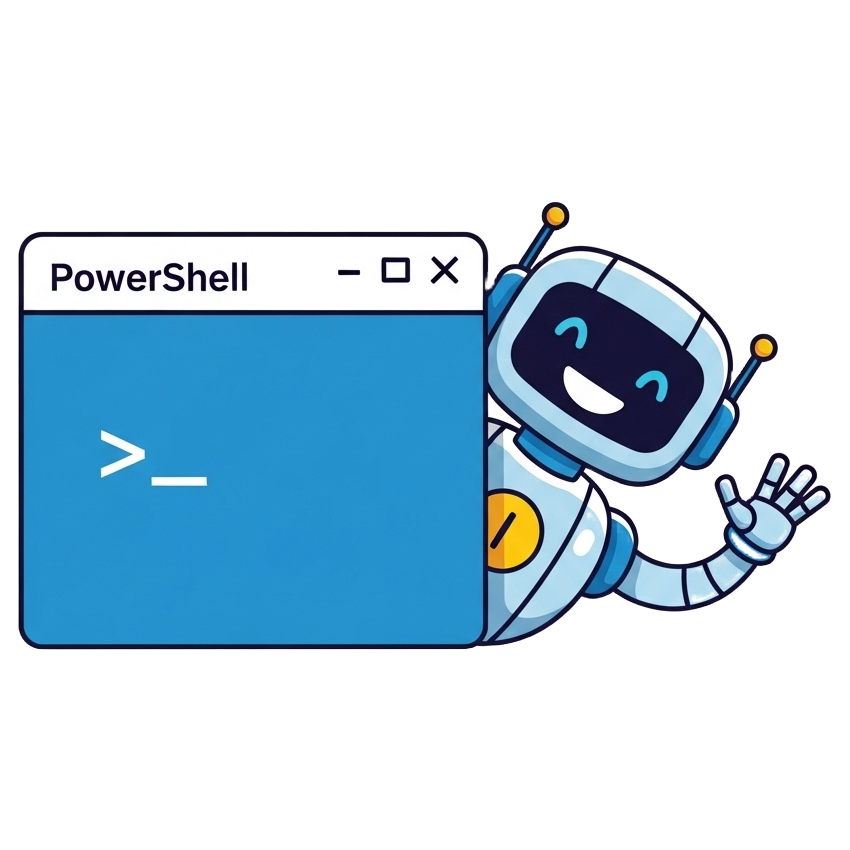

<p align="center">
  
  <br/>
  <em>A simple, powerful backup utility for Windows.</em>
  <br/><br/>
  <a href="./LICENSE">
    
  </a>
  
</p>

`RoboBackup` is a PowerShell module for running configuration-driven file backups on Windows using `robocopy.exe`. It can be operated via a command-line interface or an interactive menu.

## Features

- 📦 **Simple Installation**: A one-line command to install the module.
- 🚀 **Easy Initialization**: A one-line command to create a new configuration file.
- ⌨️ **Cmdlet-Style Usage**: Run backups with a clear, verb-noun command: `Invoke-RoboBackup`.
- 🎨 **Interactive UI**: A colorful, user-friendly menu to guide you through backups without memorizing parameters.
- 📄 **JSON Configuration**: Define all your regular backup jobs in a simple `robobackup.json` file.
- 📝 **Comprehensive Logging**: Every session is fully recorded, and each Robocopy operation creates a unique, timestamped log file.
- 🧹 **Automatic Log Rotation**: Keeps the 100 most recent log files and deletes older ones to save space.
- 💨 **Dry Run Mode**: Simulate any backup operation without actually copying, moving, or deleting files.

## Installation

To install the `RoboBackup` module, open a PowerShell terminal and run the following command. It will download and install the module into your user profile.

```powershell
Set-ExecutionPolicy Bypass -Scope Process -Force; [System.Net.ServicePointManager]::SecurityProtocol = [System.Net.ServicePointManager]::SecurityProtocol -bor 3072; iex ((New-Object System.Net.WebClient).DownloadString('https://raw.githubusercontent.com/kevinchatham/backup.ps1/main/install.ps1'))
```

> **Note on Execution Policy**: The `Set-ExecutionPolicy Bypass` command ensures the installation script can run without being blocked. This setting only affects the current PowerShell session.

After installation, you may need to restart your PowerShell session or run `Import-Module RoboBackup` to make the command available.

## Getting Started

The fastest way to get started with `RoboBackup` is to use the built-in initialization command.

1.  **Create a Configuration File**

    Open a PowerShell terminal in the folder where you want to manage your backups and run:
    ```powershell
    Invoke-RoboBackup -Init
    ```
    This will create a new `robobackup.json` file in the current directory.

2.  **Define a Backup Job**

    Open the new `robobackup.json` file and define your first backup job. For example, to back up a "Documents" folder to an external drive, your configuration might look like this:
    ```json
    {
      "jobs": [
        {
          "name": "My Documents",
          "source": "C:\Users\YourUser\Documents",
          "destination": "E:\Backups\Documents",
          "mirror": true
        }
      ]
    }
    ```

3.  **Run the Backup**

    Now, you can run your backup using the interactive menu:
    ```powershell
    Invoke-RoboBackup
    ```
    Alternatively, you can run the specific job directly from the command line:
    ```powershell
    Invoke-RoboBackup -Job "My Documents"
    ```

## Usage

`Invoke-RoboBackup` can be run in different modes depending on the parameters you provide.

### Interactive Mode

For the most user-friendly experience, run the command with no parameters. This launches a persistent, menu-driven interface.

```powershell
Invoke-RoboBackup
```

From the main menu, you can:

- Run a single pre-defined job (respecting its `mirror` setting).
- Run all pre-defined jobs sequentially.
- Run a custom one-off backup, where you will be prompted to choose between a **mirror** or **additive** backup.
- Open the logs directory.
- Display the full command-line help.
- Exit the utility.

### Command-Line Usage

You can also run backups directly from the command line.

#### **Initialize a New Configuration**
```powershell
Invoke-RoboBackup -Init
```

#### **Run a Pre-defined Job**

```powershell
Invoke-RoboBackup -Job "Documents (Mirror)"
```
This command runs the job as defined in the configuration, respecting its `mirror` property.

#### **Run All Pre-defined Jobs**

```powershell
Invoke-RoboBackup -All
```

#### **Perform a Manual (One-Off) Backup**

For manual backups, you can control the mirror behavior with the `-Mirror` switch.

-   **Mirror Backup** (Deletes extra files at destination):
    ```powershell
    Invoke-RoboBackup -Source "C:\Some\Folder" -Destination "D:\BackupLocation" -Mirror
    ```
-   **Additive Backup** (Default for manual, does not delete):
    ```powershell
    Invoke-RoboBackup -Source "C:\Some\Folder" -Destination "D:\BackupLocation"
    ```

#### **Perform a Dry Run**

Add the `-Dry` switch to any command to see what _would_ happen without changing any files.

```powershell
Invoke-RoboBackup -Job "Documents (Mirror)" -Dry
```

## Configuration

### Job Configuration

Each job in the `robobackup.json` file **must** have the following four properties:

-   `"name"`: A unique name to identify the job.
-   `"source"`: The directory to back up.
-   `"destination"`: The directory where the backup will be stored.
-   `"mirror"`: A boolean (`true` or `false`) to define the backup type.
    -   `true`: Performs a **mirror** backup (`/MIR`), which makes the destination an exact copy of the source. Any files in the destination that do not exist in the source will be **deleted**.
    -   `false`: Performs an **additive** backup (`/E`), which copies new and updated files without deleting extra files from the destination.

### Portable Configurations

The configuration system is designed to be highly portable. Because the script automatically uses a `robobackup.json` file in the current directory, you can place your configuration file in the root of a folder you intend to back up. By setting the `source` to `.` (the current directory), you create a self-contained backup definition that travels with your files.

To run the backup, simply navigate into that folder in PowerShell and run `Invoke-RoboBackup`.

### Config File Loading

The script searches for `robobackup.json` in the following order of priority:
1.  A specific file path provided using the `-Config "C:\Path\to\robobackup.json"` parameter.
2.  A file named `robobackup.json` in the current working directory.

When a configuration file is loaded, the script automatically changes its working directory to the directory containing the `robobackup.json` file. This ensures that any **relative paths** used in the `source` and `destination` fields are resolved correctly from the location of the configuration file, not from where the script was invoked. The original working directory is restored when the script finishes.

## Logging

`RoboBackup` creates two types of log files in the `RoboBackup/logs` directory:

1.  **Session Transcript**: A complete transcript of the entire script's execution is saved as `session-YYYY-MM-DD_HH-mm-ss.log`. This log captures all console output, including startup messages, configuration validation, and any errors that occur, making it ideal for debugging scheduled tasks.
2.  **Robocopy Log**: Each individual backup job generates a detailed `log-YYYY-MM-DD_HH-mm-ss.log` file containing the full output from the `robocopy.exe` command, including the list of copied files and the final summary.

## Parameters

| Parameter               | Description                                                                  |
| :---------------------- | :--------------------------------------------------------------------------- |
| `-Init`                 | A switch to create a new `robobackup.json` configuration file.               |
| `-Job <string>`         | The name of a specific backup job to run from your `robobackup.json`.        |
| `-All`                  | A switch to run all backup jobs defined in your `robobackup.json`.           |
| `-Source <string>`      | The source directory for a manual (one-off) backup.                          |
| `-Destination <string>` | The destination directory for a manual (one-off) backup.                     |
| `-Mirror`               | A switch to perform a mirror backup for a manual job. If omitted, the backup is additive. |
| `-Config <string>`      | Specifies the full path to a `robobackup.json` file to use.                  |
| `-Dry`                  | A switch to perform a dry run, simulating the backup without making changes. |
| `-Logs`                 | A switch to open the logs directory in VS Code or File Explorer.             |

## Understanding Backup Results

The script provides a clear summary of the backup result based on the exit code from Robocopy.

| Code | Meaning                                                                                 |
| :--- | :-------------------------------------------------------------------------------------- |
| 0    | **Success**: No files were copied. Source and destination are identical.                |
| 1    | **Success**: All files were copied successfully.                                        |
| 2    | **Success**: Some extra files or directories were detected in the destination.          |
| 3    | **Success**: Files were copied and extra files were detected.                           |
| 5    | **Warning**: Some files were mismatched and did not copy.                               |
| 6    | **Warning**: Mismatched files and extra files were detected.                            |
| 7    | **Success**: Files were copied, but some were mismatched and extra files were detected. |
| 8+   | **Error**: Robocopy failed with critical errors. Check the log for details.             |

## Creating a Scheduled Backup Task

You can use Windows Task Scheduler to run your backups automatically. The following steps show how to create a task that runs all jobs from your configuration file on a daily basis.

1.  Open **Task Scheduler** from the Windows Start Menu.
2.  In the **Actions** pane, click **Create Task...**.

#### **General Tab**

- **Name**: Give the task a descriptive name (e.g., `RoboBackup Daily`).
- Select **Run whether user is logged on or not**.
- Check the box for **Run with highest privileges**.

#### **Triggers Tab**

- Click **New...**.
- Configure a schedule that suits your needs. For a daily backup, select **Daily** and set a start time (e.g., `2:00 AM`).

#### **Actions Tab**

- Click **New...**.
- **Action**: `Start a program`.
- **Program/script**: `pwsh.exe` (or `powershell.exe`)
- **Add arguments**: `-Command "& { Import-Module RoboBackup; Invoke-RoboBackup -All -Config 'C:\Path\To\Your\robobackup.json' }"`

> **Important**: Using the `-Config` parameter with an absolute path is the most reliable way to ensure the script can always find your configuration file when run via Task Scheduler. This avoids any ambiguity related to the "Start in" directory.

> **Note on PowerShell Version**: While this module works with both modern PowerShell (`pwsh.exe`) and the older Windows PowerShell (`powershell.exe`), using `pwsh.exe` is strongly recommended for better performance and future compatibility.

#### **Settings Tab**

- Review the default settings. You may want to adjust options like **Stop the task if it runs longer than:** or **Stop if the computer switches to battery power** to fit your needs.

5.  Click **OK** to save the task. You may be prompted to enter your user password.

Your automated backup task is now ready. It will run at the scheduled time without any manual intervention.

## Uninstall

To uninstall the `RoboBackup` module, run the following command in PowerShell. This will remove the module from your user profile.

```powershell
Remove-Item -Path (Join-Path ([Environment]::GetFolderPath('MyDocuments')) 'PowerShell\Modules\RoboBackup') -Recurse -Force
```

## Development and Local Testing

If you are developing the script and want to test your changes locally, the easiest method is to use the included `test.ps1` script.

1.  **Open a PowerShell terminal** in the project's root directory.
2.  **Run the test script**:
    ```powershell
    .\test.ps1
    ```
This script will automatically clear the console, import the latest version of the module, and launch `Invoke-RoboBackup` in interactive mode, allowing you to quickly test your changes.